# ???

dnSpy is a tool to reverse engineer .NET assemblies. It includes a decompiler, a debugger and an assembly editor (and more) and can be easily extended by writing your own extension. It uses [dnlib](https://github.com/0xd4d/dnlib) to read and write assemblies so it can handle obfuscated assemblies (eg. malware) without crashing.

# Binaries

[Latest release](https://github.com/0xd4d/dnSpy/releases)

[Latest BETA build](https://ci.appveyor.com/project/0xd4d/dnspy/build/artifacts)

# Features

- Open Source (GPLv3) and Free Forever (:TM:)
- Assembly Editor
	- Use C# or Visual Basic to edit any method, property and event
	- Code editor has IntelliSense (code completion and signature help)
	- Whole classes can be added to assemblies by adding C# and Visual Basic code
	- Edit all metadata of types (classes), methods, properties, events, fields
	- Add, remove, rename any type (class), method, property, event, field
	- Edit, add, remove .NET resources and save them to disk
	- The IL editor allows editing method bodies at the IL level: IL instructions, locals, exception handlers
- Debugger
	- Debug any .NET assembly, no source code required
	- Set breakpoints in any assembly, including framework assemblies, assemblies in the GAC and assemblies existing only in memory
	- Memory window
	- Output window
	- Attach to process
	- Locals window
		- raw contents of locals (eg. decrypted byte arrays) can be saved to disk
	- Call Stack window
	- Threads window
	- Modules window
		- Modules (eg. decrypted in-memory modules) can be saved to disk
	- Exception Settings
	- Can debug dynamic assemblies
	- Debugging CoreCLR assemblies is supported
- Decompile to C#, Visual Basic, IL
- Themes: blue, dark, light (and high contrast)
- Supports smaller screens (eg. laptops)
	- Line height can be optimized for smaller screens
		- Blank and non-alphanumeric lines are 75% the normal height
		- No extra spacing between lines (saves 1 vertical pixel per line)
	- Menu and toolbar share the same line
	- Full screen mode (Shift+Alt+Enter) saves some vertical pixels
- High DPI support and per-monitor DPI-aware
- Translated to several languages
- Highly extensible
	- Write your own extensions and add your own features
	- All major features are already extensions (assembly editor, debugger, decompiler)
- Multiple tabs and tab groups
	- Your screen is too big? Don't cut it in half, add another vertical tab group and read two classes at once!
	- The tabs and positions within the text editors are saved when you close dnSpy and restored at startup so you can continue where you left off
- Search assemblies
	- Search for types (classes), methods, properties, events, fields
	- Search for strings or numbers in code
- Assembly analyzer
	- Find usages of types (classes), methods, properties, events, fields
- BAML to XAML decompiler
- Fast
- Highlighted references, keywords
	- References under the caret are highlighted to make it easier to see all uses of the reference in the code
	- Tab, Shift+Tab, Ctrl+Shift+Up, Ctrl+Shift+Down moves to the next or previous reference
	- Alt+Down and Alt+Up moves to the next or previous definition (type (class), method, property, event, field)
- Structure visualizer
	- Vertical guide lines shown between start and end of code blocks
	- Different colors are used for different blocks, eg. loop, conditional, method, etc
- [dnlib](https://github.com/0xd4d/dnlib) is used to read and write assemblies so it can handle obfuscated code (eg. malware) without crashing
- Go to commands:
	- Entry point
	- Assembly static initialization method (&lt;Module&gt;..cctor)
	- Any metadata token
	- Any metadata row
- Syntax highlighted tooltips with XML doc comments when hovering over a type (class), method, property, event, field
- Methods, properties and events are decompiled in source code order or a custom user-defined order
	- Source code order means that related methods are usually next to each other, just like the programmer wanted
- Background images can be shown in the text editor
- Export to project decompiles all selected assemblies and creates a Visual Studio solution
	- Multiple assemblies can be exported at the same time
	- Creates a Visual Studio solution (supports VS2005 - VS-latest) and project files
	- Supports WinForms and WPF classes (creates a code-behind .cs/.vb file and a WinForms .resx / WPF .xaml file)
	- Converts .NET resources to .resx files
- Open from GAC
- Command line decompiler
	- Supports Windows, Linux and Mac
	- Syntax highlights output to the screen
- Scripting with C# REPL
	- Call public dnSpy methods from scripts
	- Script the debugger and other extensions
- Hex editor
- Method tokens and addresses are shown in comments and can be clicked to go to the raw metadata or IL bytes
- Metadata editor
- Collapse Assembly Explorer nodes command to quickly collapse unused nodes
- And more...

# Picture time!

### Edit any method, property or event in C# or Visual Basic

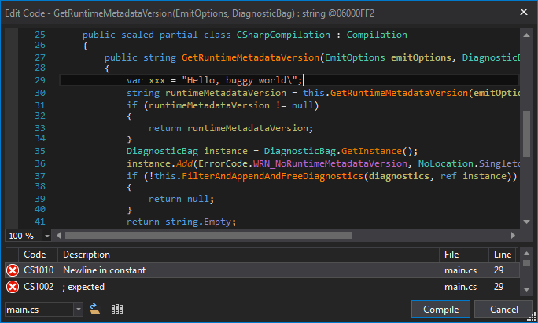

### Edit any type (class), method, property, event, field

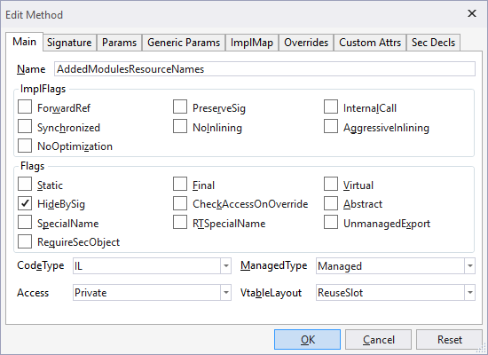

### Add, remove, rename any type (class), method, property, event, field

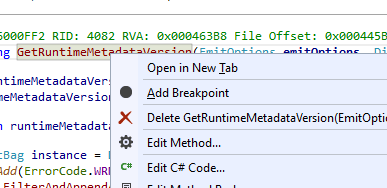

### Edit, add, remove .NET resources and save them to disk

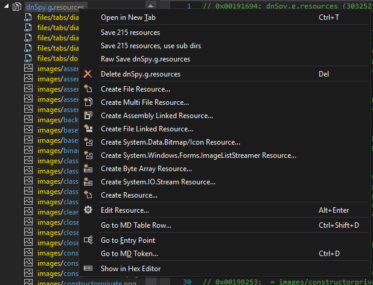

### The IL editor allows editing method bodies at the IL level: IL instructions, locals, exception handlers

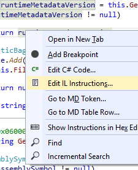

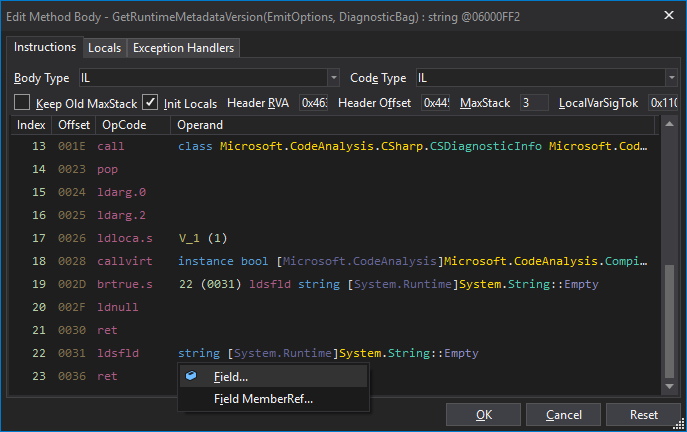

### Debug any .NET assembly, no source code required

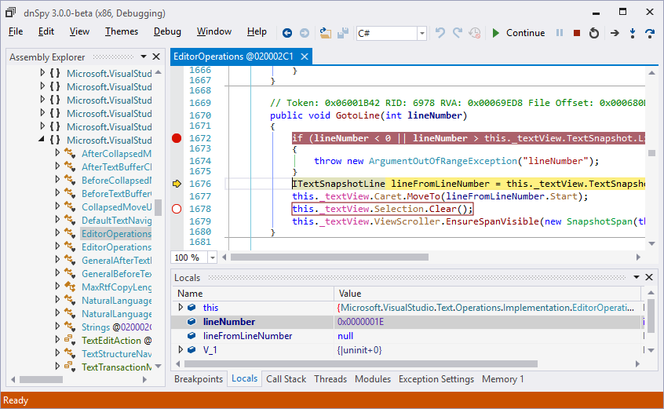

### Raw contents of locals (eg. decrypted byte arrays) can be saved to disk

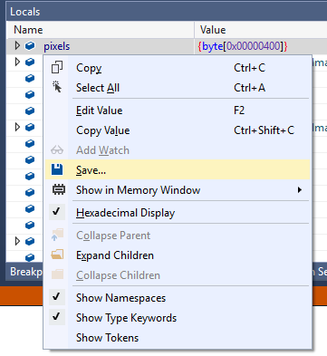

### Optimizations for smaller screens

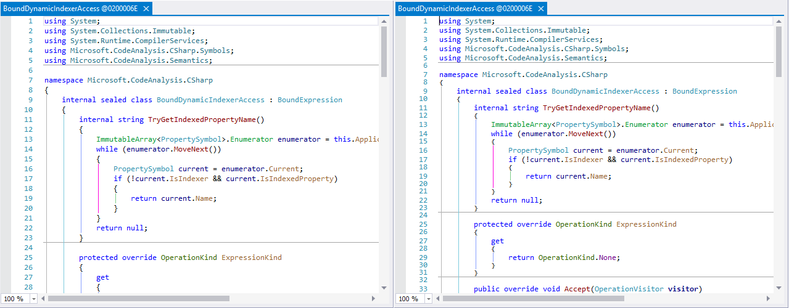

### Multiple tabs and tab groups

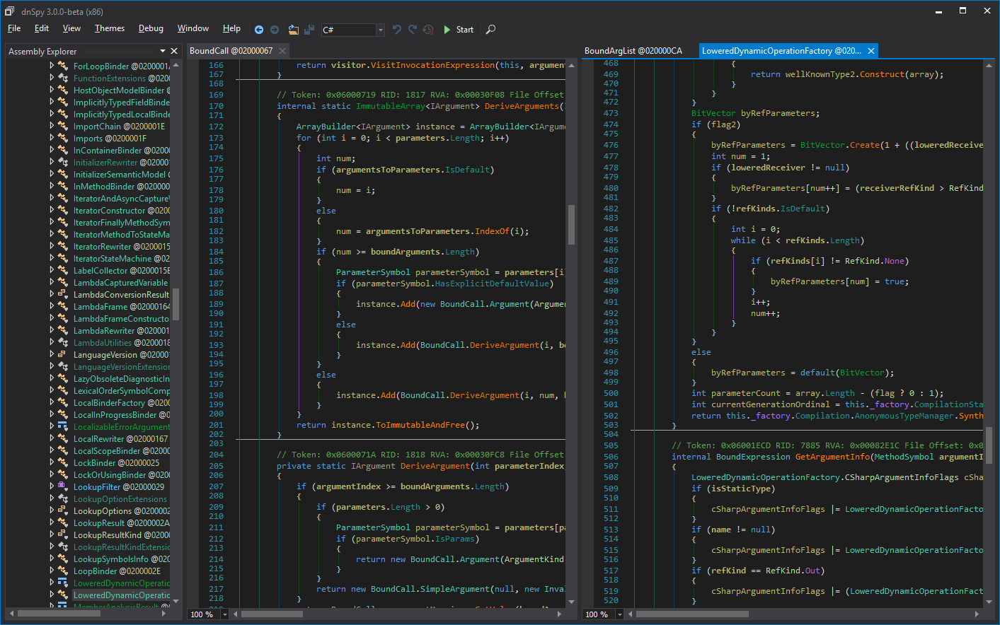

### Search assemblies

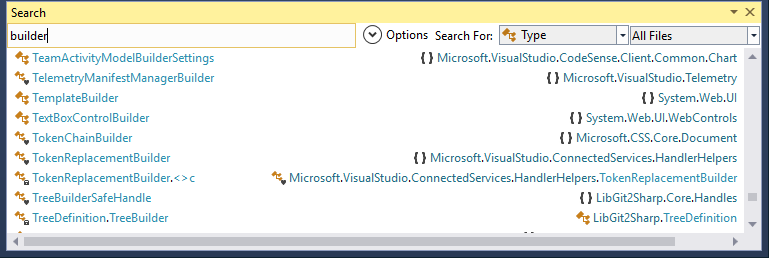

### Assembly analyzer

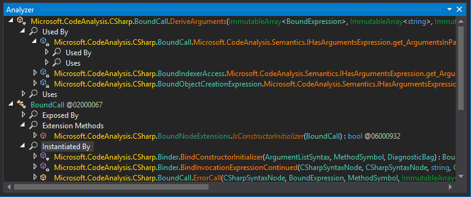

### Highlighted references, keywords, use Tab, Shift+Tab, Ctrl+Shift+Up, Ctrl+Shift+Down to select next or previous reference or Alt+Up/Down for next definition

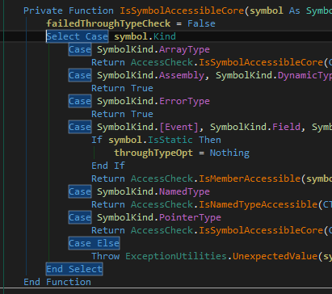

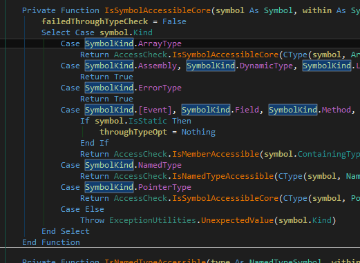

### Structure visualizer adds colorized vertical guide lines between braces; loops, try/catch and conditional blocks are shown in different colors

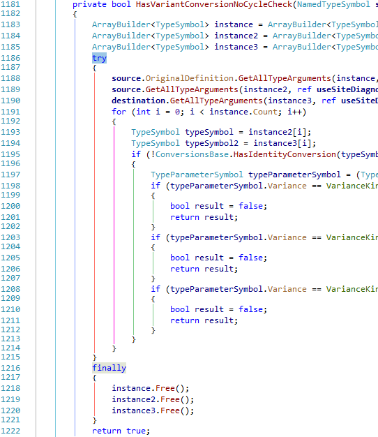

### Structure visualizer is very useful when you're in a method like this:

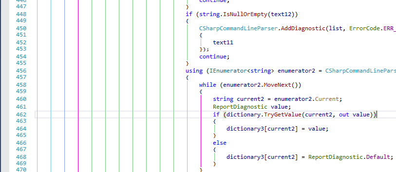

### Go to: Entry Point, Module Initializer, MD Token, MD Table Row

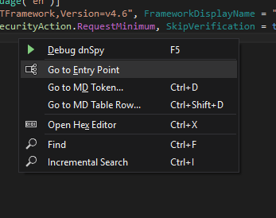

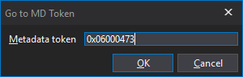

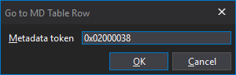

### Syntax highlighted tooltips with XML doc comments when hovering over a type (class), method, property, event, field

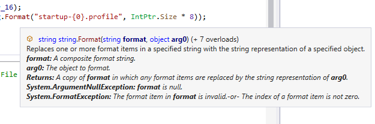

### Background images can be shown in the text editor

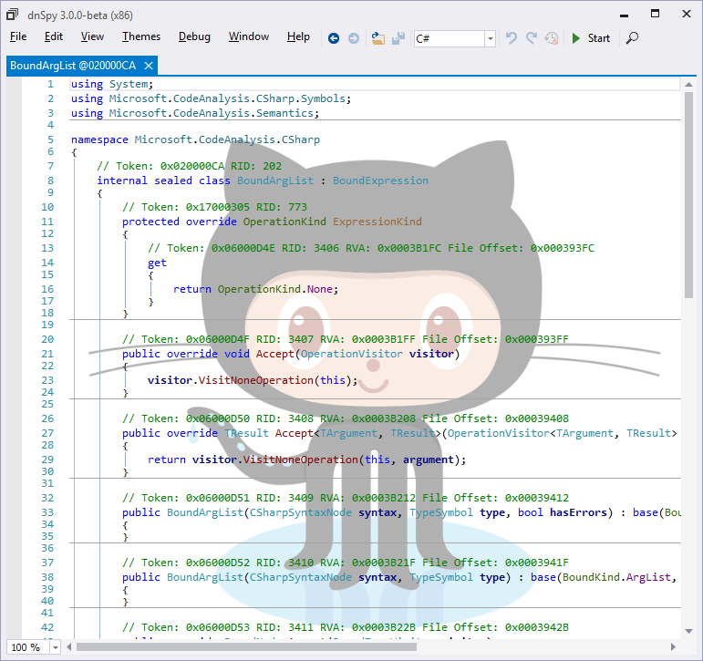

### Same image with left margin and top margin set to 75%

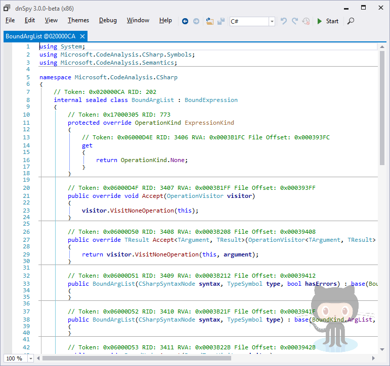

### Background image settings tab

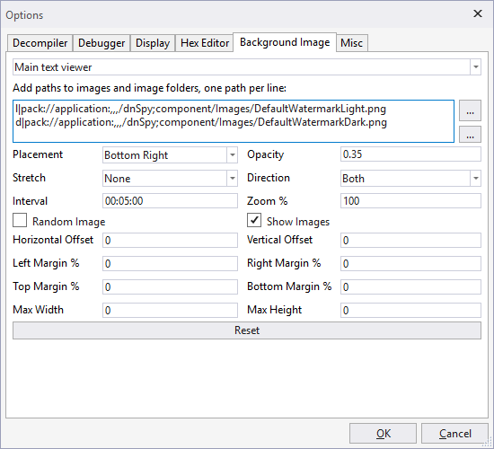

### Export to project decompiles all selected assemblies and creates a Visual Studio solution

### Command line decompiler, supports Windows, Linux, Mac

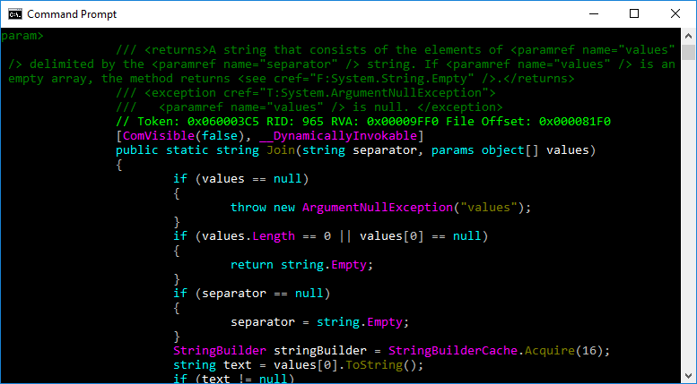

### Scripting with `C#` REPL, control the debugger and other extensions with `C#`

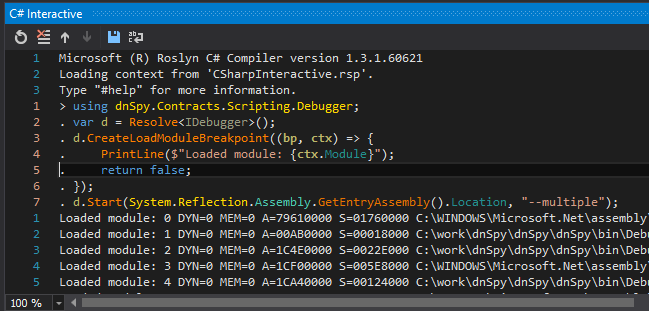

### Hex editor

### Metadata editor, click on a token or press Ctrl+Shift+D

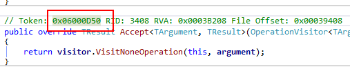

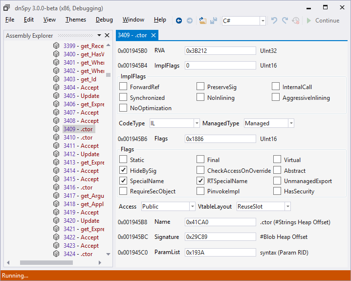

# Want to Contribute?

Check the [issues](https://github.com/0xd4d/dnSpy/issues) for open issues, especially issues with the [up for grabs](https://github.com/0xd4d/dnSpy/issues?q=is%3Aissue+is%3Aopen+label%3A%22up+for+grabs%22) tag since they should be easier to start with.

If you send a PR, try to use the same coding style as the current project you're editing. Here's a short list:

- Standard C# coding convention except:
- Tabs, size = 4
- Open curly braces ({) are always on the same line as the `if`/`while`/method-signature
- Use `var` most of the time, except for primitive types where you can use the primitive type (eg. `int`) instead of `var`
- Only use 'this.' if required

# Translating dnSpy

[Click here](https://crowdin.com/project/dnspy) if you want to help with translating dnSpy to your native language.

# Wiki

See the [Wiki](https://github.com/0xd4d/dnSpy/wiki) for build instructions and other documentation.

# License

dnSpy is licensed under [GPLv3](LicenseInfo/GPLv3.txt).

# [Credits](LicenseInfo/CREDITS.txt)
