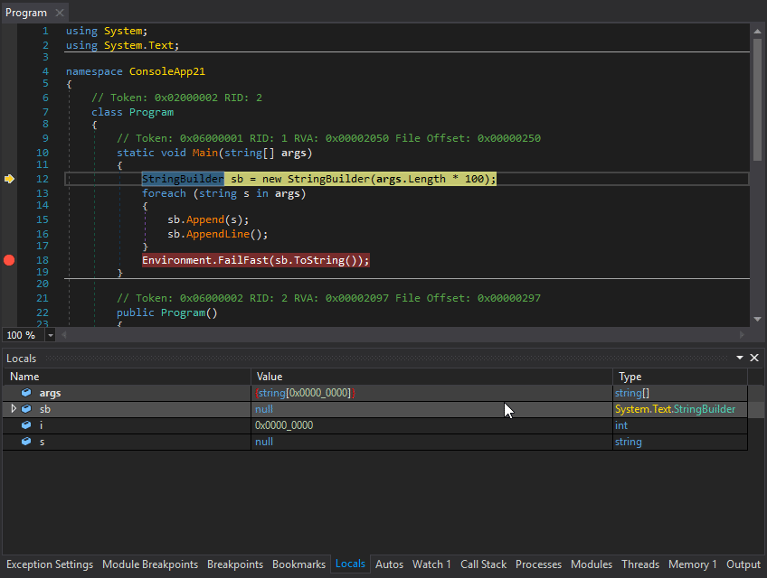
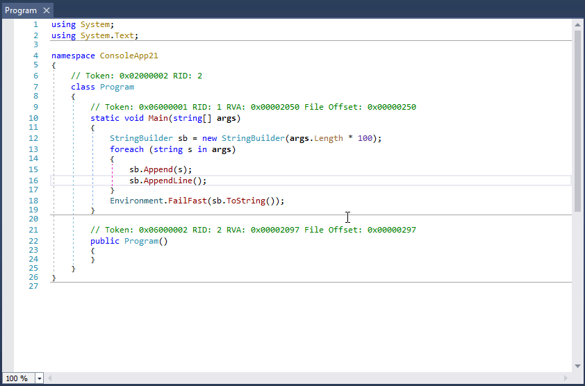

# dnSpy

dnSpy is a debugger and .NET assembly editor. You can use it to edit and debug assemblies even if you don't have any source code available.

Want to say thanks? Click the star at the top of the page. Or fork dnSpy and send a PR!

The following pictures show dnSpy in action. It shows dnSpy editing and debugging a .NET EXE file, not source code.

# Features (see below for more detail)

- Debug .NET Framework, .NET Core and Unity game assemblies, no source code required
- Edit assemblies in C# or Visual Basic or IL, and edit all metadata
- Light and dark themes
- Extensible, write your own extension
- High DPI support (per-monitor DPI aware)
- And much more, see below

dnSpy uses the ILSpy decompiler engine and the Roslyn (C# / Visual Basic) compiler and many other open source libraries, see below for more info.

# Binaries

[Latest release](https://github.com/0xd4d/dnSpy/releases) (Note: Required .NET Runtime version is [.NET Framework 4.7.2](https://dotnet.microsoft.com/download/thank-you/net472))

Latest build: 

Or build it from source, see the [Wiki](https://github.com/0xd4d/dnSpy/wiki/Building-dnSpy).

# Debugger

- Debug .NET Framework, .NET Core and Unity game assemblies, no source code required
- Set breakpoints and step into any assembly
- Locals, watch, autos windows
- Variables windows supports saving variables (eg. decrypted byte arrays) to disk or view them in the hex editor (memory window)
- Object IDs
- Multiple processes can be debugged at the same time
- Break on module load
- Tracepoints and conditional breakpoints
- Export/import breakpoints and tracepoints
- Call stack, threads, modules, processes windows
- Break on thrown exceptions (1st chance)
- Variables windows support evaluating C# / Visual Basic expressions
- Dynamic modules can be debugged (but not dynamic methods due to CLR limitations)
- Output window logs various debugging events, and it shows timestamps by default :)
- Assemblies that decrypt themselves at runtime can be debugged, dnSpy will use the in-memory image. You can also force dnSpy to always use in-memory images instead of disk files.
- Public API, you can write an extension or use the C# Interactive window to control the debugger

# Assembly Editor

- All metadata can be edited
- Edit methods and classes in C# or Visual Basic with IntelliSense, no source code required
- Add new methods, classes or members in C# or Visual Basic
- IL editor for low level IL method body editing
- Low level metadata tables can be edited. This uses the hex editor internally.

# Hex Editor

- Click on an address in the decompiled code to go to its IL code in the hex editor
- Reverse of above, press F12 in an IL body in the hex editor to go to the decompiled code or other high level representation of the bits. It's great to find out which statement a patch modified.
- Highlights .NET metadata structures and PE structures
- Tooltips shows more info about the selected .NET metadata / PE field
- Go to position, file, RVA
- Go to .NET metadata token, method body, #Blob / #Strings / #US heap offset or #GUID heap index
- Follow references (Ctrl+F12)

# Other

- BAML decompiler
- Blue, light and dark themes (and a dark high contrast theme)
- Bookmarks
- C# Interactive window can be used to script dnSpy
- Search assemblies for classes, methods, strings etc
- Analyze class and method usage, find callers etc
- Multiple tabs and tab groups
- References are highlighted, use Tab / Shift+Tab to move to next reference
- Go to entry point and module initializer commands
- Go to metadata token or metadata row commands
- Code tooltips (C# and Visual Basic)
- Export to project

# List of other open source libraries used by dnSpy

- ILSpy decompiler engine (C# and Visual Basic decompilers)
- Roslyn (C# and Visual Basic compilers)
- dnlib (.NET metadata reader/writer which can also read obfuscated assemblies)
- VS MEF (Faster MEF equals faster startup)
- ClrMD (Access to lower level debugging info not provided by the CorDebug API)

# Translating dnSpy

[Click here](https://crowdin.com/project/dnspy) if you want to help with translating dnSpy to your native language.

# Wiki

See the [Wiki](https://github.com/0xd4d/dnSpy/wiki) for build instructions and other documentation.

# License

dnSpy is licensed under [GPLv3](dnSpy/dnSpy/LicenseInfo/GPLv3.txt).

# [Credits](dnSpy/dnSpy/LicenseInfo/CREDITS.txt)
